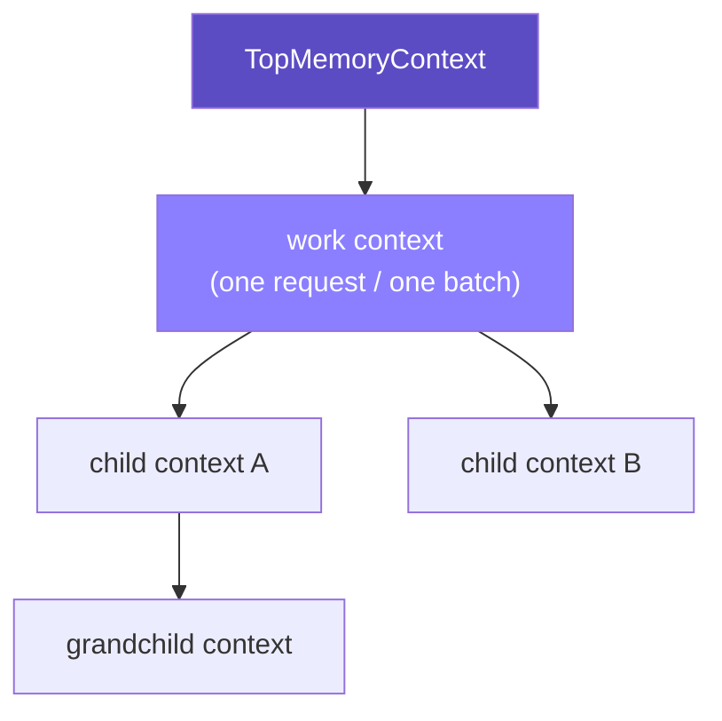

# MemoryContext

A hierarchical arena allocator for C, extracted from PostgreSQL's memory
context subsystem into a standalone library.

Memory lives in a tree of **contexts**. Every allocation belongs to exactly
one context, and discarding a context — reset it, or delete it outright —
discards everything under it in one call, no matter how large or deeply
nested.

It's the same pattern PostgreSQL itself uses internally to avoid
manual per-object bookkeeping: allocate freely inside one context, then
free the whole batch at once.

## Architecture

Every context tracks a parent, a first child, and two siblings — enough to
walk the tree in any direction and unlink any node in O(1):



Delete `Work`, and everything under it — `ChildA`, `ChildB`, `Grand` —
goes with it, cascading bottom-up and running any registered cleanup
callbacks along the way.

Resetting a context is not the same as deleting it:

| Operation | Children | This context's own memory | The context node itself |
|---|---|---|---|
| `MemoryContextResetOnly` | untouched | freed | survives |
| `MemoryContextReset` | **deleted** | freed | survives, reusable |
| `MemoryContextDelete` | deleted | freed | freed too |

A context you reset between batches and only delete once, at the end of a
loop, is the whole point: allocate freely inside one iteration, reset,
repeat — no leaks, no per-object bookkeeping.

The tree/lifecycle logic above never looks at *how* a context actually
allocates memory — that's behind a small, swappable function-pointer
interface. `aset.c`, a general-purpose block/freelist allocator, is the
only strategy implemented today; see [Roadmap](#roadmap) for the rest.

## Build & usage

```bash
make check                       # builds libmctx.a, runs the test suite
make install PREFIX=/usr/local   # installs libmctx.a + headers
```

```c
#include <mctx.h>

MemoryContextInit();

MemoryContext work = AllocSetContextCreate(TopMemoryContext, "work",
                                            ALLOCSET_DEFAULT_SIZES);
MemoryContext old = MemoryContextSwitchTo(work);

char *buf = palloc(64);          /* allocated in `work` */
/* ... do things with buf ... */
pfree(buf);                      /* free it immediately, if you want to */

MemoryContextSwitchTo(old);
MemoryContextDelete(work);       /* anything you didn't pfree is gone too */
```

`mctx.h` is the single include for consumers. One caveat: the public API
keeps PostgreSQL's own names (`palloc`, `pfree`, `MemoryContextCreate`,
...), unprefixed — don't link this into a binary that also links a real
PostgreSQL/libpq, or those symbols will collide.

## Roadmap

| Allocator | Status | Best for |
|---|---|---|
| `aset.c` (AllocSet) | ✅ done | general purpose — the default |
| `alignedalloc.c` | ✅ done | `palloc_aligned()` support |
| `slab.c` | 🔲 todo | many fixed-size objects |
| `generation.c` | 🔲 todo | FIFO-ish allocation/free patterns |
| `bump.c` | 🔲 todo | dense, never-individually-freed chunks |

Also on the list: `MemoryContextStats` (introspection/debug printing) and
`MEMORY_CONTEXT_CHECKING` debug builds (needs a minimal `elog()` first).
None of these block normal use — they're all additive.

## Acknowledgments

This library is almost entirely PostgreSQL's own work: the design and the
bulk of the source code come directly from `src/backend/utils/mmgr/` in
the PostgreSQL source tree, maintained by the PostgreSQL Global
Development Group. This project just extracts it into something usable
outside a Postgres backend.

Licensed under the PostgreSQL License — see [`LICENSE`](./LICENSE).
