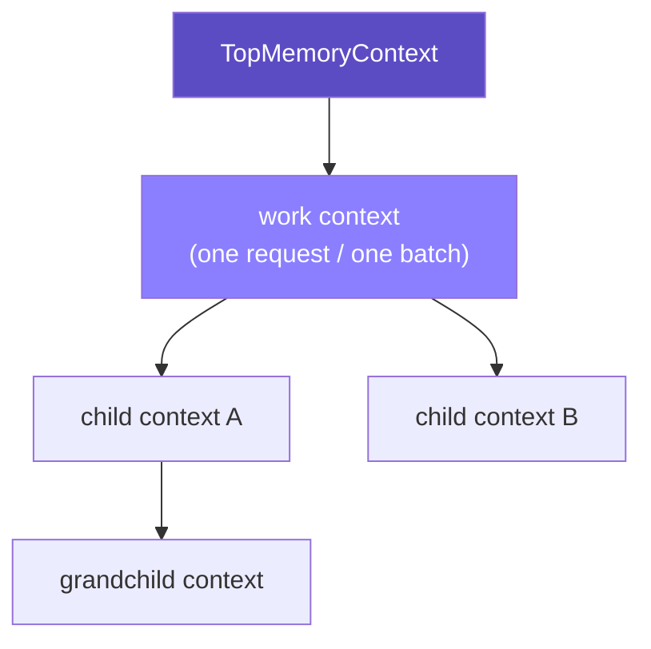
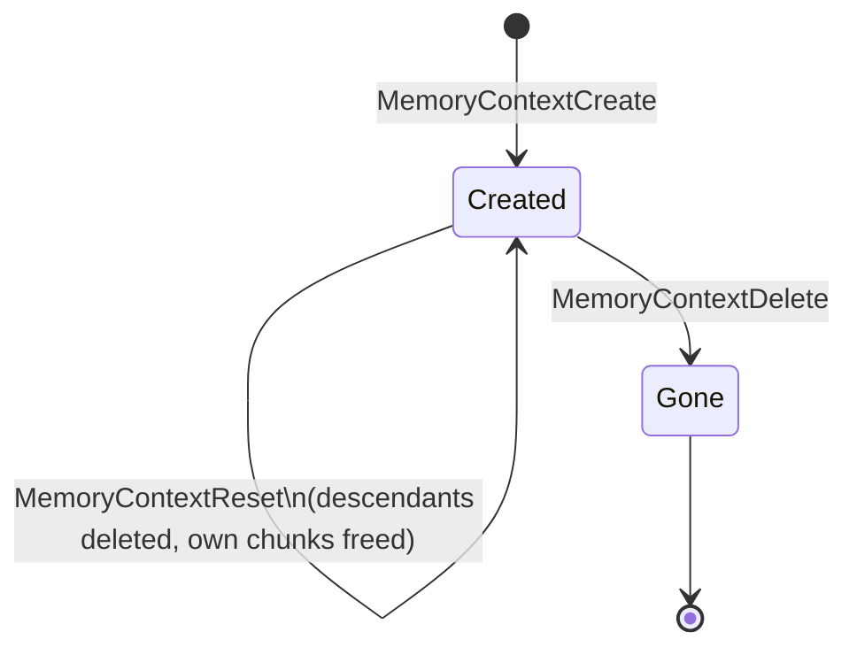

# MemoryContext

A hierarchical arena allocator for C, extracted from PostgreSQL's memory
context subsystem (`src/backend/utils/mmgr/`) into a standalone library.

Memory lives in a tree of **contexts**. Every allocation belongs to exactly
one context. Discarding a context — reset it, or delete it outright —
discards everything under it, no matter how deep the tree grew, in one call.

---

## Why a tree of allocators

Plain `malloc`/`free` makes you responsible for every pointer individually.
MemoryContext inverts that: you don't free objects, you free **scopes**.



Delete `Work`, and `ChildA`, `ChildB`, and `Grand` go with it — cascading,
bottom-up, running any cleanup callbacks along the way. No traversal code,
no "did I forget to free that one struct in the error path" bugs.

Every context carries exactly four links — enough to walk the tree in any
direction and unlink any node in O(1):


## Lifecycle: reset ≠ delete

| Operation | Children | This context's own memory | The context node itself |
|---|---|---|---|
| `MemoryContextResetOnly` | untouched | freed | survives |
| `MemoryContextReset` | **deleted** | freed | survives, reusable |
| `MemoryContextDelete` | deleted | freed | freed too |



A context you reset between batches and only delete once, at the end of a
loop, is the whole point: allocate freely inside one iteration, reset, repeat
— no leaks, no per-object bookkeeping.

## One interface, pluggable allocation strategy

```c
typedef struct MemoryContextMethods
{
    void       *(*alloc)            (MemoryContext context, Size size, int flags);
    void        (*free_p)           (void *pointer);
    void       *(*realloc)          (void *pointer, Size size, int flags);
    void        (*reset)            (MemoryContext context);
    void        (*delete_context)   (MemoryContext context);
    MemoryContext (*get_chunk_context)(void *pointer);
    Size        (*get_chunk_space)  (void *pointer);
    bool        (*is_empty)         (MemoryContext context);
    void        (*stats)            (MemoryContext, MemoryStatsPrintFunc, void *, MemoryContextCounters *, bool);
} MemoryContextMethods;
```

`aset.c` (the general-purpose block/freelist allocator, described below) is
the only implementation wired up in this port, but the tree/lifecycle/
callback machinery above never looks at *how* a context allocates — it only
ever calls through this table. Adding a fixed-size slab allocator or a
bump/arena allocator later means writing a second table with the same nine
entry points; nothing above this layer changes.

Dispatch works because every allocated chunk carries an 8-byte header
directly in front of it — packed, not a pointer:


```
 63                                   34 33          4 3   0
┌──────────────────────────────────────┬──────────────┬─────┐
│  30-bit block offset (or "external") │  30-bit value │ ID  │
└──────────────────────────────────────┴──────────────┴─────┘
                                                          ↑
                                    4 bits: which allocator owns this chunk
```

`pfree()` on *any* pointer, from *any* context, resolves to the right
allocator with no context argument needed:

```c
void
pfree(void *pointer)
{
    MCXT_METHOD(pointer, free_p)(pointer);
}
```

## The reference allocator: `aset.c`

Optimized for the common case — many small, short-lived allocations. Instead
of calling into the system allocator per request, it grabs memory in blocks
(doubling in size up to a cap) and hands out slices until a block runs out.

- **Small requests** (≤ 8 KB by default) are bucketed into one of 11
  power-of-two free lists. A freed chunk goes straight onto its bucket and
  gets reused by the next matching request — no `malloc`/`free` round trip.
- **Large requests** skip the buckets and get one block sized to fit exactly,
  freed back to the OS immediately on `pfree`.
- The context header and its first ("keeper") block share one `malloc` call
  and survive every reset, so a context that's reset in a tight loop never
  thrashes the system allocator.

## Out-of-memory: aborts, not exceptions

Real PostgreSQL's `palloc()` never returns `NULL` — allocation failure
unwinds the call stack via `longjmp` back to a transaction savepoint. This
library has nowhere to unwind to, so instead:

- `palloc()` / `palloc0()` / `repalloc()` **abort the process** (with a
  diagnostic on stderr) on failure.
- Pass `MCXT_ALLOC_NO_OOM` (via `palloc_extended()` / `palloc_aligned()`)
  if you want a clean `NULL` back instead, same as upstream PostgreSQL.

This isn't a stylistic choice — code ported verbatim from PostgreSQL assumes
`palloc()` cannot fail and never checks. Aborting keeps that assumption
true; returning `NULL` unconditionally would just turn every such call site
into a silent, delayed segfault.

## What's implemented

| Allocator | Status | Best for |
|---|---|---|
| `aset.c` (AllocSet) | ✅ ported | general purpose — the default |
| `alignedalloc.c` | ✅ ported | `palloc_aligned()` support |
| `slab.c` | ⛔ not ported | many fixed-size objects |
| `generation.c` | ⛔ not ported | FIFO-ish allocation/free patterns |
| `bump.c` | ⛔ not ported | dense, never-individually-freed chunks |

The three unported allocators' type tags and dispatch-table slots are
reserved (see `pg_compat.h` / `mctx_internal.h`), so plugging them in later
doesn't require renumbering anything.

Also not ported: `MemoryContextStats` (introspection/debug printing),
SIGUSR1-triggered context logging, and `MEMORY_CONTEXT_CHECKING` debug
builds (the source compiles out cleanly, matching upstream's own `#ifdef`
structure — turning it on needs a working `elog()`, which this port doesn't
have). None of these affect the allocator itself.

## ⚠️ Don't link this alongside a real PostgreSQL/libpq

The public API intentionally keeps PostgreSQL's own names — `palloc`,
`pfree`, `repalloc`, `MemoryContextCreate`, and so on are exact,
unprefixed matches for real PostgreSQL's global symbols. That's fine for
a standalone program, but if this library ends up in the same binary as
`libpq`, an actual PostgreSQL extension, or anything else that links
against real Postgres internals, you'll get duplicate-symbol errors at
link time — or, worse, silently call the wrong implementation under
dynamic linking. This library has no namespacing to prevent that; keep
it out of any binary that also links against real PostgreSQL.

## Quick start

```bash
make check                # builds libmctx.a, runs the test suite under test/
make install PREFIX=/usr/local   # installs libmctx.a + headers under $(PREFIX)
```

```c
#include <mctx.h>

MemoryContextInit();

MemoryContext work = AllocSetContextCreate(TopMemoryContext, "work",
                                            ALLOCSET_DEFAULT_SIZES);
MemoryContext old = MemoryContextSwitchTo(work);

char *buf = palloc(64);          /* allocated in `work` */
/* ... do things ... */

MemoryContextSwitchTo(old);
MemoryContextDelete(work);       /* everything under `work` is gone */
```

`mctx.h` is the single include for consumers — it pulls in the full public
API. After `make install`, compile against it with `-I$(PREFIX)/include/mctx
-L$(PREFIX)/lib -lmctx`.

Verified clean under `-Wall`, AddressSanitizer, and UndefinedBehaviorSanitizer.

## Layout

```
mctx.h                   single public include (-> memutils.h + palloc.h)
pg_compat.h              c.h/postgres.h stand-in (Size, Assert, NodeTag, ...)
mctx_internal.h          MemoryContextMethodID table, OOM/abort reporters
memutils_memorychunk.h   the MemoryChunk bit-packed header
memnodes.h / memutils.h / palloc.h   ported public headers
memdebug.h               vendored Valgrind no-op stubs
mcxt.c                   context tree, lifecycle, palloc family, dispatch
aset.c                   the AllocSet block/freelist allocator
alignedalloc.c           palloc_aligned() support
test/                    test suite (test.h + one file per area)
```

## License

PostgreSQL License — see [`LICENSE`](./LICENSE). This project contains code
derived from PostgreSQL (`src/backend/utils/mmgr/`); the PostgreSQL Global
Development Group's copyright notice is preserved in both the ported source
files and `LICENSE`.
